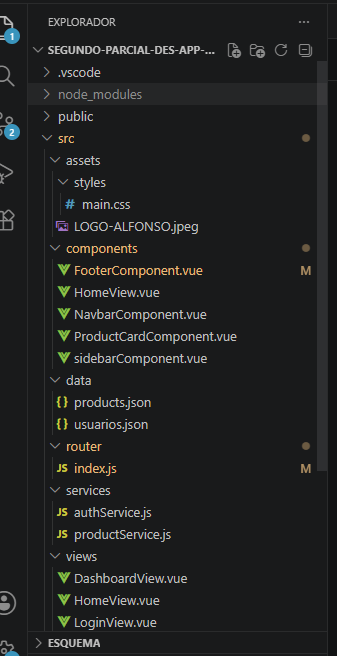
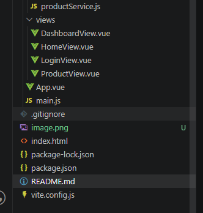

# Vue 3 + Vite
-Descripción general del negocio y objetivo de la aplicación.

Esta aplicación web fue desarrollada para gestionar productos escolares e institucionales del colegio ITAL.  

El sistema permite a los usuarios iniciar sesión según su rol (profesor o estudiante), visualizar productos escolares, administrar información y navegar entre diferentes módulos de la plataforma.

El objetivo principal de la aplicación es aplicar conceptos de desarrollo frontend utilizando Vue 3, Vite y Vue Router, implementando una arquitectura modular y organizada.


-Información relevante de los integrantes o desarrolladores de la aplicación. 

Luisa Fernanda Ortega Santiago - Desarrolladora Frontend 
Juan Diego Garcia Quintero - Backend y lógica 

-Estructura del proyecto en una imagen



-Modularización de la aplicación

La aplicación fue desarrollada utilizando una estructura modular para mejorar la organización del código y facilitar el mantenimiento.

Componentes
Los componentes se encuentran en la carpeta:

```bash
src/components/
```

Componentes implementados

Componente- funcion 
NavbarComponent.vue -	Barra superior con información del usuario
FooterComponent.vue	- Pie de página institucional
ProductCardComponent.vue - Tarjeta reutilizable para mostrar productos
sidebarComponent.vue - Menú lateral de navegación

Vistas
Las vistas principales del sistema se encuentran en:

```bash
src/views/
```
Componente	Función

Vistas implementadas

 Vista - Función 

HomeView.vue - Página principal del sistema 
LoginView.vue - Inicio de sesión 
ProductView.vue - Visualización de productos 
DashboardView.vue - Panel principal del usuario 

Rutas
La navegación se implementó mediante Vue Router.

-Ejemplo de consumo de la API externa para gestionar los productos.
La aplicación utiliza un servicio para obtener la información de los productos almacenados en el archivo `products.json`.

El servicio se encuentra en:

```bash
src/services/productService.js
```

 Ejemplo de consumo

```js
import productos from '../data/products.json'

export function obtenerProductos() {
  return productos
}
```

## Uso en una vista

```js
import { obtenerProductos } from '../services/productService'

export default {
  data() {
    return {
      productos: []
    }
  },

  mounted() {
    this.productos = obtenerProductos()
  }
}
```

Con este proceso se cargan dinámicamente los productos en la aplicación.

-Ejemplo de comunicación entre componentes (props o eventos).

La comunicación entre componentes se realizó mediante `props`, permitiendo enviar información desde un componente padre hacia un componente hijo.

---

Componente Padre

```html
<ProductCardComponent
  :nombre="producto.nombre"
  :precio="producto.precio"
  :imagen="producto.imagen"
/>
```


 Componente Hijo

```js
export default {
  props: {
    nombre: String,
    precio: Number,
    imagen: String
  }
}
```

Los `props` permiten reutilizar componentes mostrando información diferente según el producto seleccionado.

-Evidencia del trabajo colaborativo (enlaces a commits, ramas, PRs).
https://github.com/juandy412/segundo-parcial-des-app-web/commit/7aeea5c5f0910eaea3af6979c06fbdb08f868e43
https://github.com/juandy412/segundo-parcial-des-app-web/commit/17e70a9e9343e72141e4d8b8142e22de22432b75
https://github.com/juandy412/segundo-parcial-des-app-web/commit/1b7bb15f1d534089345eaf24e272eae130d2e1b2
https://github.com/juandy412/segundo-parcial-des-app-web/commit/ac889eddd08b98e5c185bf3629f9996da482a56c
https://github.com/juandy412/segundo-parcial-des-app-web/commit/54056a605954e764120b336ec3aed1ce78abf24f
https://github.com/juandy412/segundo-parcial-des-app-web/commit/fd8d0ea48551844beefe554e3113553deb670038
https://github.com/juandy412/segundo-parcial-des-app-web/commit/81f2841d1c87e8162401b734986f27f7dae22e2e


This template should help get you started developing with Vue 3 in Vite. The template uses Vue 3 `<script setup>` SFCs, check out the [script setup docs](https://v3.vuejs.org/api/sfc-script-setup.html#sfc-script-setup) to learn more.

Learn more about IDE Support for Vue in the [Vue Docs Scaling up Guide](https://vuejs.org/guide/scaling-up/tooling.html#ide-support).
